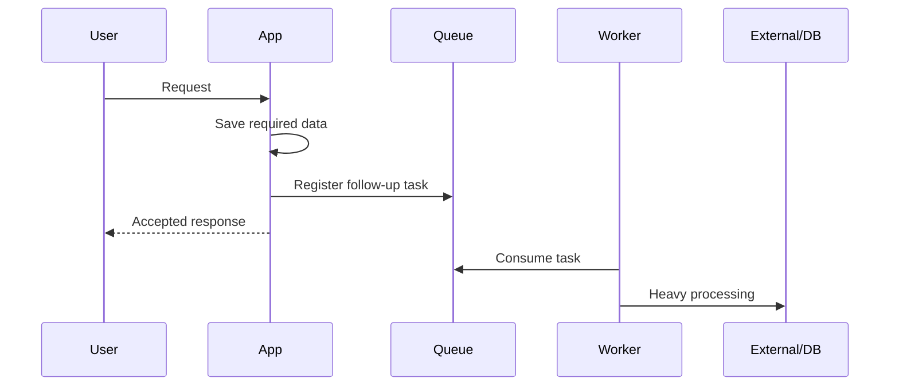
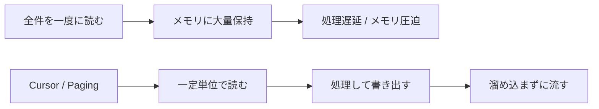
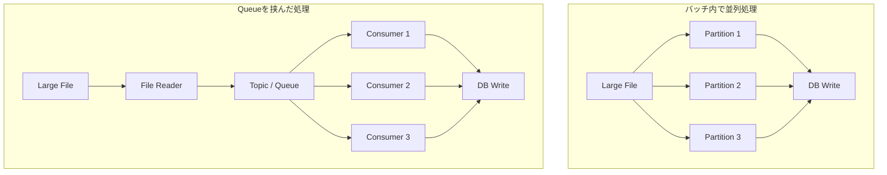

# バッチ処理で学んだ、性能改善を「処理フロー」から考えること

こんにちは。
大阪事業部の〇〇です。

今回は、業務の中で考える機会があった「性能改善」について書いてみたいと思います。

性能改善と聞くと、Redis、Kafka、インデックス、キャッシュなどの技術名が先に浮かぶことがあります。
もちろん、どれも大切な選択肢です。
ただ、実際にバックエンド開発やバッチ処理に関わる中で感じたのは、技術名から考え始めると判断を間違えやすいということでした。

大事なのは、まず「どこで時間がかかっているのか」を分けることだと思います。
特に大量データを扱う処理では、処理フロー全体を見て、読む処理なのか、書く処理なのかを分けて考えると、問題が整理しやすくなりました。

### ■処理フローでボトルネックを確認する

性能問題を見るとき、私はまず処理フロー全体を大まかに思い浮かべるようにしています。

ユーザー操作から始まる処理もあれば、決まった時間に動くバッチ処理や、外部システムと連携する処理もあります。
その中で、どこで待っているのか、どこで同じ作業を繰り返しているのか、どこで大量のデータを抱えているのかを見るようにしています。

例えば、読む処理であれば、

・Webやネットワーク側で毎回処理する必要があるのか  
・アプリケーション内で同じデータを繰り返し読んでいないか  
・DBで探す範囲が広すぎないか、一度に読みすぎていないか  

といった観点で見ます。

書く処理であれば、

・今すぐ処理する必要があるのか  
・後ろの処理に回せるものはないか  
・1件ずつ書いていて負荷が高くなっていないか  
・外部システムが受けられる速度を超えていないか  

といった見方になります。

これは万能な正解表ではありません。
ただ、自分が性能問題を見たときに、考えを散らかさないための地図として役に立っています。

### ■書く処理の場合

書く処理が遅い場合は、「この処理は本当に今すぐ全部終わらせる必要があるのか」を考えます。

例えば、ある処理の中でDB保存、ログ記録、通知、外部システムへの送信、後続の集計処理まで行っているとします。
この場合、すべての処理が終わるまで待つことになります。

しかし、よく見ると、その中には応答前に必ず終わっていなければならない処理と、後から処理してもよい処理が混ざっていることがあります。

ここで大事なのは、書く処理をさらに2つに分けることです。

1つ目は、応答前に確定していないといけない書き込みです。
例えば、申請や注文の作成、ステータス変更、残高や在庫のように、結果を返す前に状態が決まっていないと困るものです。
こうした処理は、簡単に後ろへ回すことはできません。

この場合は、キューに逃がすよりも、同期で行う処理の範囲を小さくすることを考えます。
トランザクションの中に不要な処理を入れていないか、外部通信を含めていないか、同じデータを何度も更新していないか、ロックが長くなっていないかを見るイメージです。

2つ目は、後から処理してもよい書き込みです。
ログ、通知、外部システム連携、後続の集計などは、要件によっては後ろの処理に回せる場合があります。

この場合は、キューや非同期処理、バッチワーカーに処理を渡すことで、待ち時間と実際に重い処理を行う時間を分けることができます。

また、DB更新についても、1件ずつ処理するとネットワーク往復やトランザクションのコストが積み重なります。
chunk単位でまとめて処理したり、bulk updateを使ったりすることで、書き込みの負荷を下げられる場合があります。

書く処理の改善は、単に「もっと速く書く」ことだけではありません。
今すぐ確定すべき書き込みは短く確実に行い、後から処理できる書き込みは切り離す。
このように分けることから始まるのだと思います。

### ■読む処理の場合

読む処理が遅い場合も、まずどの層で読み込みが重くなっているのかを分けて考えます。

まずWebやネットワークに近い部分では、そもそも毎回サーバー側で処理する必要があるかを見ます。
静的なリソースや更新頻度の低いレスポンスであれば、ブラウザキャッシュやCDNによって、サーバーまで届くリクエスト自体を減らせる場合があります。

次にアプリケーション内では、同じデータを何度も読んでいないかを見ます。
頻繁に参照される一方で更新頻度が低いコード情報や設定値であれば、メモリキャッシュやRedisのようなキャッシュが有効な選択肢になります。
ただし、更新頻度が高いデータや、古い値を返すことが大きな問題になるデータでは、キャッシュが新しい障害ポイントになることもあります。

最後にDBやバッチ処理の層では、探す範囲が広すぎないか、一度に読みすぎていないかを見ます。
クエリが重い場合は、条件や取得カラム、実行計画、インデックスを確認します。
読み込み負荷が大きい場合は、レプリケーションで読み込み先を分けることもあります。
テーブルや処理対象が大きい場合は、パーティショニングによって対象範囲を分けることも選択肢になります。

大量データを扱うバッチ処理では、さらに「少しずつ処理する」ことが重要になります。
全件をメモリに載せるのではなく、カーソル読み込みやページングで少しずつ読み、chunk単位で処理する。
必要に応じてパーティションを分け、独立した単位として処理する。
このように、DBからの読み方とアプリケーション側の処理単位を合わせて考える必要があります。

ここでいうchunkは、DBそのものの機能というより、バッチやアプリケーション側で「どの単位で読んで処理するか」を決める考え方に近いです。
一方、bulk updateのようなものは、主に書く処理でDBへの往復回数を減らすための手段として考えています。

同じ読む処理でも、繰り返し読むデータなのか、一度だけ流すデータなのかで、選ぶ手段は変わるのだと感じました。

### ■適用例

ここからは、実際の業務をイメージしやすいように、簡単な例で考えてみます。
もちろん、特定の案件の話ではなく、バックエンドやバッチ処理でよく出てくる考え方として読んでいただければと思います。

#### 適用例1: 大量データを読み込み、ファイルを作成するバッチ

あるバッチで、大量のデータを読み込み、外部提出用のファイルを作成するとします。
データ量が増えるにつれて、DBから取得する件数が多くなり、ファイル出力にも時間がかかるようになります。
メモリ使用量が不安定になったり、途中で失敗したときに最初からやり直すコストが大きくなったりすることもあります。

この場合のボトルネックは、単に「読むのが遅い」というより、扱うデータの量が大きすぎることです。
そのため、まず考えるのは、処理対象をどの単位で分けるかでした。

例えば、期間が広い処理であれば月単位や日単位に分ける。
さらに、その中でもID範囲や日付などでパーティションを分け、独立した単位として並列実行できるようにする。
各パーティションの中では、全件を一度にメモリへ載せるのではなく、カーソル読み込みやページングで少しずつ読み、chunk単位で処理します。

書く処理としても、状態更新を1件ずつ行うのではなく、chunkやbulkでまとめることが選択肢になります。

ただし、並列化すれば必ずよいわけではありません。
重要なデータを扱う場合は、途中で失敗したときにどこから再開できるか、同じデータを二重に処理しないか、処理後に件数や結果を検証できるかも一緒に考える必要があります。

私自身も、大きな単位をそのまま処理するのではなく、影響範囲を小さく分けて、失敗した地点からやり直せる構造にすることの重要性を感じました。

#### 適用例2: 大きなファイルを読み込み、DBに反映する処理

大きなファイルを読み込み、内容を検証してDBに反映する処理もあります。
最初は、バッチの中でファイルを分割し、複数スレッドで並列処理する方法を考えました。

これは自然な発想だと思います。
ただ、処理フローとして見ると、ファイルを読む処理とDBに書く処理が同じ流れの中にあります。
そのため、DBへの反映が遅くなると、ファイル読み込み側もその影響を受けやすくなります。

そこで、ファイルを読む処理とDBに反映する処理の間にキューを置く構成を考えることがあります。
ファイルリーダーは読み込んだデータをできるだけ早くトピックへ流し、DB反映は複数のコンシューマーで処理します。

この構成のポイントは、単にMQを使うことではありません。
ファイルを読む速度と、DBに書く速度を分けて考えられることです。

ファイルを読む処理は先に進め、DB反映はDBが処理できる範囲でコンシューマー数やbatch sizeを調整する。
こうすると、バッチ内でパーティショニングするよりも、読み込みと書き込みをそれぞれ調整しやすくなる場合があります。

もちろん、この方法にも注意点があります。
メッセージの重複処理、再試行、処理済み管理、DB反映結果の検証などを考える必要があります。
それでも、読み込みと書き込みの速度差が大きい処理では、キューを挟むことで全体の処理が安定することがありました。

#### 適用例3: 外部システムの速度に合わせる必要がある場合

こちらのシステムだけを速くしても、全体として安定しないケースもあります。
例えば、外部システムにデータを送信する処理で、こちらは高い並列度で送れるとしても、相手側が受けられる速度には限界があります。

この場合、ボトルネックは自分たちのDBやコードではなく、外部システムとの境界にあります。
そのため、単純にスレッド数を増やしたり、並列度を上げたりすることが正解とは限りません。

キューに積んでワーカーが順番に処理する、一定件数ごとに区切る、TPSを制御する。
こうした方法で、相手側が受けられる速度に合わせることも性能改善の一部だと感じました。

全体の完了時間は少し長くなるかもしれません。
しかし、失敗率や再処理のコストを下げられるのであれば、安定性という意味ではよい選択になる場合があります。

### ■トレードオフについて

もちろん、こうした方法を使えばすべて解決するわけではありません。

キャッシュには、整合性、TTL、更新タイミングの問題があります。
インデックスは読み込みを速くできますが、書き込み時にはインデックス更新のコストが増えます。
キューや非同期処理は応答を速くできますが、再試行、重複処理、完了状態の管理が必要になります。
レプリケーションは読み込み負荷を分散できますが、反映遅延を考える必要があります。

性能改善は、単に速くする作業ではなく、どのコストをどこに移すかを考える作業でもあると感じています。

技術を導入する前に、今の問題が読む処理なのか、書く処理なのか。
繰り返し読むデータなのか、一度だけ流すデータなのか。
今すぐ処理すべきものなのか、後から処理してもよいものなのか。

このように分けて考えることで、技術選定の理由も説明しやすくなります。

### ■まとめ

以前は、性能改善というとRedisやKafkaのような技術名を先に考えがちでした。

しかし、バッチ処理や大量データ処理を経験する中で、まず処理フローを見て、読む処理なのか、書く処理なのかを分けることの大切さを学びました。

技術は答えではなく、ボトルネックを分類した後に選ぶ手段です。

これからも性能問題に向き合うときは、「何を導入するか」よりも先に、「どこが、なぜ遅いのか」を考える姿勢を大事にしていきたいです。

ここまで読んでいただき、ありがとうございました。
