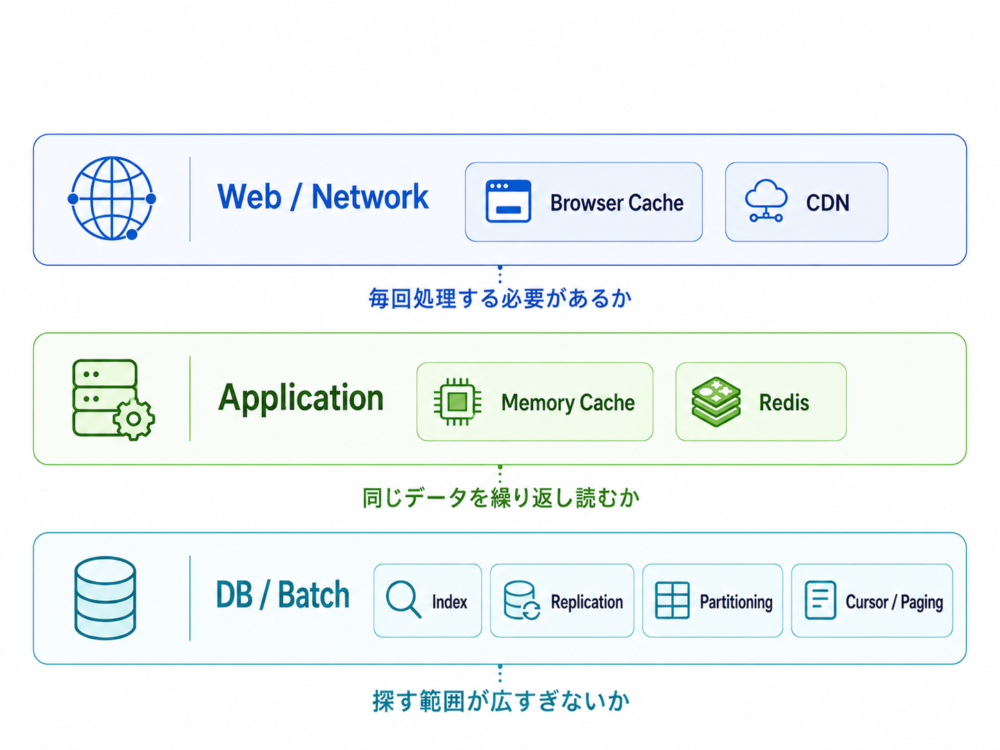
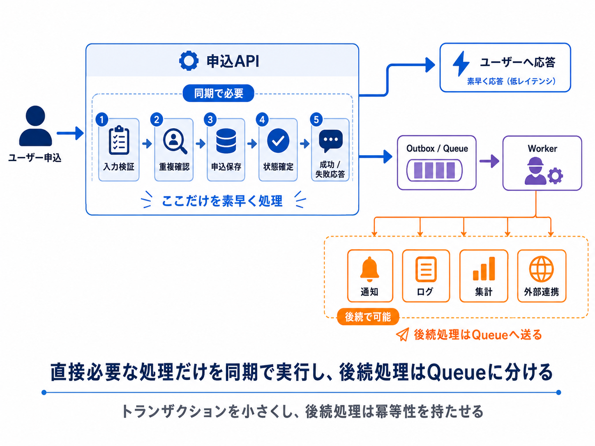
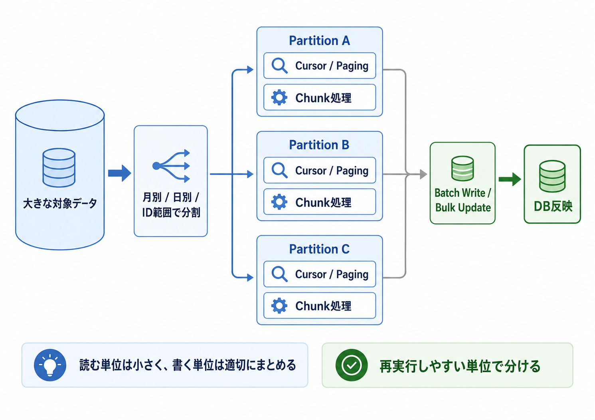
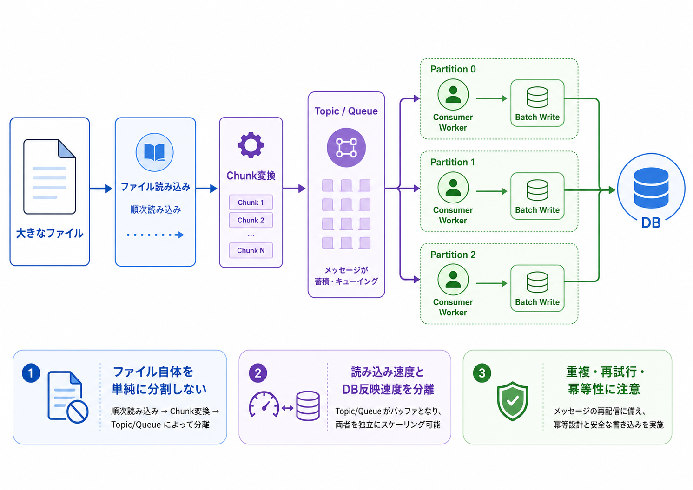
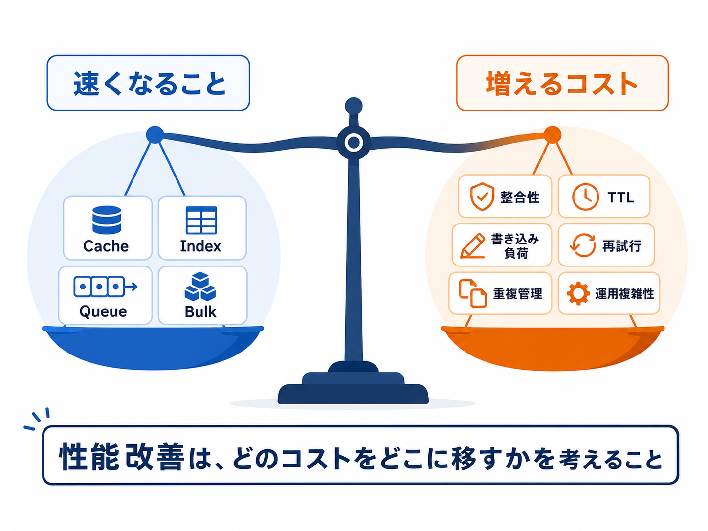

# 性能改善は、まず「読む」と「書く」に分けて考える

こんにちは。
大阪事業部のM・Kです。

今回は、業務の中で考える機会があった「性能改善」について書いてみたいと思います。

性能改善と聞くと、Redis、Kafka、インデックス、キャッシュなどの技術名が先に浮かぶことがあります。
もちろん、どれも大切な選択肢です。
ただ、実際にバックエンド開発やバッチ処理に関わる中で感じたのは、技術名から考え始めると判断を間違えやすいということでした。

大事なのは、まず「どこで時間がかかっているのか」を分けることだと思います。
特に大量データを扱う処理では、処理フロー全体を見て、読む処理なのか、書く処理なのかを分けて考えると、問題が整理しやすくなりました。

### ■処理フローでボトルネックを確認する

性能問題を見るとき、私はまず処理フロー全体を大まかに思い浮かべるようにしています。

そこで見るのは今遅いのは**読む処理**か、それとも**書く処理**なのかを考えます。

**読む処理**であれば、

・Webやネットワーク側で毎回処理する必要があるのか  
・アプリケーション内で同じデータを繰り返し読んでいないか  
・DBで探す範囲が広すぎないか、一度に読みすぎていないか  

といった観点で見ます。

**書く処理**であれば、

・今すぐ処理する必要があるのか  
・後ろの処理に回せるものはないか  
・1件ずつ書いていて負荷が高くなっていないか  
・外部システムが受けられる速度を超えていないか  

といった見方になります。

これは万能な正解表ではありません。
ただ、自分が性能問題を見たときに、考えを散らかさないための地図として役に立っています。

### ■読む処理の場合

読む処理が遅い場合、まずどの層で読み込みが重くなっているのかを分けて考えます。

まず**Webやネットワーク**に近い部分では、そもそも毎回サーバー側で処理する必要があるかを見ます。
静的なリソースや更新頻度の低いレスポンスであれば、ブラウザキャッシュやCDNによって、サーバーまで届くリクエスト自体を減らせる場合があります。

次に**アプリケーション内**では、同じデータを何度も読んでいないかを見ます。
頻繁に参照される一方で更新頻度が低いコード情報や設定値であれば、メモリキャッシュやRedisのようなキャッシュが有効な選択肢になります。
ただし、更新頻度が高いデータや、古い値を返すことが大きな問題になるデータでは、キャッシュが新しい障害ポイントになることもあります。

最後に**DBやバッチ処理の層**では、探す範囲が広すぎないか、一度に読みすぎていないかを見ます。
クエリが重い場合は、条件や取得カラム、実行計画、インデックスを確認します。
読み込み負荷が大きい場合は、レプリケーションで読み込み先を分けることもあります。
テーブルや処理対象が大きい場合は、パーティショニングによって対象範囲を分けることも選択肢になります。

大量データを扱うバッチ処理では、さらに「少しずつ処理する」ことが重要になります。
全件をメモリに載せるのではなく、カーソル読み込みやページングで少しずつ読み、chunk単位で処理する。
必要に応じてパーティションを分け、独立した単位として処理する。
このように、DBからの読み方とアプリケーション側の処理単位を合わせて考える必要があります。

ここでいうchunkは、DBそのものの機能というより、バッチやアプリケーション側で「どの単位で読んで処理するか」を決める考え方に近いです。
一方、bulk updateのようなものは、主に書く処理でDBへの往復回数を減らすための手段として考えています。

同じ読む処理でも、繰り返し読むデータなのか、一度だけ流すデータなのかで、選ぶ手段は変わるのだと感じました。

### ■書く処理の場合

書く処理が遅い場合、「この処理は本当に今すぐ全部終わらせる必要があるのか」を考えます。

例えば、ある処理の中でDB保存、ログ記録、通知、外部システムへの送信、後続の集計処理まで行っているとします。
この場合、すべての処理が終わるまで待つことになります。

しかし、よく見ると、その中には応答前に必ず終わっていなければならない処理と、後から処理してもよい処理が混ざっていることがあります。

ここで大事なのは、書く処理をさらに2つに分けることです。

**1つ目は、応答前に確定していないといけない書き込み**です。
例えば、申請や注文の作成、ステータス変更、残高や在庫のように、結果を返す前に状態が決まっていないと困るものです。
こうした処理は、簡単に後ろへ回すことはできません。

この場合は、キューに逃がすよりも、同期で行う処理の範囲を小さくすることを考えます。
トランザクションの中に不要な処理を入れていないか、外部通信を含めていないか、同じデータを何度も更新していないか、ロックが長くなっていないかを見るイメージです。

**2つ目は、後から処理してもよい書き込み**です。
ログ、通知、外部システム連携、後続の集計などは、要件によっては後ろの処理に回せる場合があります。

この場合は、Kafkaなどのメッセージキューや非同期処理、バッチに処理を渡すことで、待ち時間と実際に重い処理を行う時間を分けることができます。

また、DB更新についても、1件ずつ処理するとネットワーク往復やトランザクションのコストが積み重なります。
chunk単位でまとめて処理したり、bulk updateを使ったりすることで、書き込みの負荷を下げられる場合があります。

書く処理の改善は、単に「もっと速く書く」ことだけではありません。
今すぐ確定すべき書き込みは短く確実に行い、後から処理できる書き込みは切り離す。
このように分けることから始まるのだと思います。

### ■適用例

ここからは、実際の業務をイメージしやすいように、簡単な例で考えてみます。

#### 適用例1: メイン画面の表示APIが遅い場合

例えば、アプリのメイン画面を表示するAPIが遅いケースを考えてみます。

メイン画面では、お知らせ、バナー、イベント情報、ユーザーごとの状態、最近の利用履歴、推薦データなど、複数の情報をまとめて返すことがあります。

このとき、単純に「APIが遅いからRedisを入れる」と考えるのではなく、まず処理フローの中身を分けて見ます。

お知らせやバナーのように、多くのユーザーが同じ内容を見るデータで、更新頻度も低いものはキャッシュしやすい対象です。
このようなデータであれば、HTTPキャッシュ、CDN、Redis、アプリケーション内キャッシュなどを検討できます。

一方で、ユーザーごとのポイント、進行中の状態、直近の利用履歴のようなデータは、古い値を返すとユーザー体験に影響する場合があります。
この場合は、キャッシュよりも先に、クエリの実行計画、インデックス、取得件数、不要なJOIN、必要以上に広い検索範囲を確認する方が効果的なことがあります。

また、推薦データや集計値のように計算コストが高いものは、リクエストのたびに計算するのではなく、事前に計算した結果テーブルや集計テーブルを参照する構成も考えられます。

つまり、同じ「読む処理」でも、繰り返し読まれるデータなのか、最新性が必要なデータなのか、DB検索が重いのか、計算処理が重いのかによって、選ぶ対策は変わります。

#### 適用例2: 申込・登録APIが遅い場合

次に、申込や登録のような書き込みAPIが遅いケースを考えてみます。
例えば、ユーザーが何かに申し込むAPIで、入力内容の検証、重複申込の確認、申込データの保存、状態履歴の保存、通知送信、集計更新、外部システム連携まで同じ流れで行っているとします。

このようなAPIが遅い場合、まず考えるべきことは「どこまでをユーザー応答の前に完了させる必要があるか」です。

申込データの保存、重複申込の防止、申込状態の確定は、ユーザーに成功・失敗を返すために必要な処理です。
ここを安易に非同期にすると、ユーザーは申込できたのか分からなくなってしまいます。

一方で、通知送信、ログ記録、集計更新、外部システムへの後続連携は、必ずしも同じトランザクション内で完了している必要がない場合があります。
この部分をQueueや非同期処理に分けることで、APIの応答時間を短くできます。

このとき重要なのは、単に「Queueを入れる」ことではなく、同期処理として残す範囲を小さくすることです。
応答に必要な書き込みだけをトランザクション内に残し、後続処理はoutbox patternなどで分離する。
そのうえで、worker側では再試行、重複実行、処理済み管理を考え、idempotency keyや一意制約などを使って、二重に実行されても壊れにくい設計にします。

書き込み処理では、「すぐ終わらせる」だけでなく、「どこまでを今すぐ確定し、どこからを後続処理にできるか」を分けることが大事だと感じています。

#### 適用例3: DBから大量データを読み込み、DBに反映するバッチ

まず、DBから大量データを読み込み、検証や加工を行ったうえでDBへ反映するバッチを考えてみます。

この場合、ボトルネックは「同じデータを繰り返し読むこと」ではなく、一度に扱う対象が大きすぎることにあります。
そのため、キャッシュを入れるよりも先に、処理対象をどの単位で分けるかを考えます。

例えば、対象期間が広い処理であれば、月別、日別、ID範囲などで処理範囲を分けます。
それぞれの範囲を独立した単位として扱えるようにすると、失敗した場合の影響範囲を小さくでき、再実行もしやすくなります。

各範囲の中では、全件を一度にメモリへ載せるのではなく、CursorやPagingで少しずつ読み込み、chunk単位で検証や変換を行います。
これにより、メモリ使用量を安定させながら、大量データを流すように処理できます。

書き込み側でも、1件ずつinsert/updateするのではなく、chunk単位でbatch writeやbulk updateにまとめることで、DBへの往復回数を減らせます。
このように、大量データを扱うバッチでは、読む単位を小さくし、書く単位は適切にまとめることが重要になります。

ただし、並列化すれば必ずよいわけではありません。
同じデータを二重に処理しないか、どこから再開できるか、処理後に件数や結果を検証できるかも一緒に考える必要があります。

#### 適用例4: 大きなファイルを読み込み、DBに反映するバッチ

一方で、大きなファイルを読み込み、内容を検証してDBに反映する処理では、少し考え方が変わります。

DBから読むデータであれば、日付やID範囲で処理対象を分けやすいことがあります。
しかし、1つのファイルを扱う場合は、ファイル自体を単純にpartitioningして並列に読むのが難しいことがあります。
ヘッダーやフッター、文字コード、読み込み途中の失敗、再開位置の管理などを考える必要があるためです。

私が経験したケースでは、ファイル読み込みそのものは順次進め、読み込んだデータをchunk単位で変換し、メッセージキューへ流す構成にしました。
その後、DB反映は複数のConsumer側で処理します。

この構成のポイントは、単にMQを使うことではありません。
ファイルを読む速度と、DBに書く速度を分けて考えられることです。

ファイルを読む処理は先に進め、DB反映はDBが処理できる範囲でConsumer数やbatch sizeを調整する。
こうすると、ファイル読み込み側とDB反映側をそれぞれ別の観点で調整しやすくなります。

もちろん、この方法にも注意点があります。
メッセージの重複処理、再試行、どこまで処理済みかの管理、DB反映時の冪等性、反映結果の検証などを考える必要があります。
そのため、最初から複雑な構成を選ぶというより、ファイル読み込みとDB反映の速度差がボトルネックになる場合の選択肢として考えるのが自然だと思います。

### ■トレードオフについて

もちろん、こうした方法を使えばすべて解決するわけではありません。

キャッシュには、整合性、TTL、更新タイミングの問題があります。

インデックスは読み込みを速くできますが、書き込み時にはインデックス更新のコストが増えます。

キューや非同期処理は応答を速くできますが、再試行、重複処理、完了状態の管理が必要になります。

レプリケーションは読み込み負荷を分散できますが、反映遅延を考える必要があります。

性能改善は、単に速くする作業ではなく、どのコストをどこに移すかを考える作業でもあると感じています。

技術を導入する前に、今の問題が読む処理なのか、書く処理なのか。
繰り返し読むデータなのか、一度だけ流すデータなのか。
今すぐ処理すべきものなのか、後から処理してもよいものなのか。

このように分けて考えることで、技術選定の理由も説明しやすくなります。

### ■まとめ

以前は、性能改善というとRedisやKafkaのような技術名を先に考えがちでした。

しかし、バッチ処理や大量データ処理を経験する中で、まず処理フローを見て、読む処理なのか、書く処理なのかを分けることの大切さを学びました。

技術は答えではなく、ボトルネックを分類した後に選ぶ手段です。

これからも性能問題に向き合うときは、「何を導入するか」よりも先に、「どこが、なぜ遅いのか」を考える姿勢を大事にしていきたいです。

ここまで読んでいただき、ありがとうございました。
